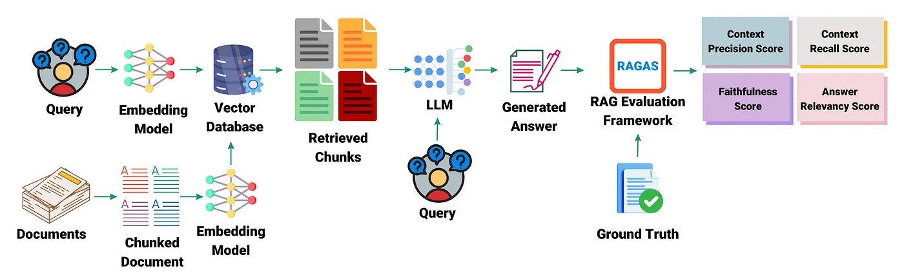
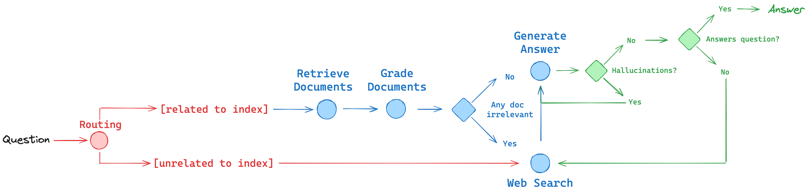

# LlamaIndexHelper
A chatbot specifically designed to answer questions relevant to LlamaIndex from LlamaIndex blogs.

## Data
- Crawl from https://www.llamaindex.ai/blog

## Pipelines
### Basic RAG pipeline

- Crawl and clean html web pages, convert html to markdown 
- Build local vector database with chromadb, qdrant
- Build document summary index
- Advanced Indexing: Sematic Chunking, Hybrid Search, MetadataFilter
- Advanced Querying: Router Query Engine, Reranker, HyDE



### Advanced RAG pipeline
Combine ideas from paper RAG papers into a RAG agent:

- **Routing:**  Adaptive RAG ([paper](https://arxiv.org/abs/2403.14403)). Route questions to different retrieval approaches
- **Fallback:** Corrective RAG ([paper](https://arxiv.org/pdf/2401.15884.pdf)). Fallback to web search if docs are not relevant to query
- **Self-correction:** Self-RAG ([paper](https://arxiv.org/abs/2310.11511)). Fix answers w/ hallucinations or don’t address question


## Models
- LLM: meta-llama/Llama3-Instruct, meta-llama/Llama3.1-Instruct
- Embedding model: BAAI/bge-base-en-v1.5
- Sparse embedding model (hybrid search): Qdrant/bm42-all-minilm-l6-v2-attentions
- Reranker: mixedbread-ai/mxbai-rerank-xsmall-v1


## Usages
- Notebook demo, compare rag techniques: `demos/...`
- Crawl blogs data
```bash
python crawl_data.py --html-dir "./data/llama-blogs-html/" --md-dir "./data/llama-blogs-md/"
```

- Indexing with QdrantDB
```bash
python index_utils.py creat_qdrant_index \
--qdrant-dir "qdrant_db/" --col-name "md-llama-blogs" \
--docs-dir "data/llama-blogs-md" -docs-metadata="data/llama_blogs_metadata.json"

python index_utils.py test_qdrant_indexing
```

- Basic rag pipeline demo
```bash
python rag_basic_pipeline.py 
```

- Advanced rag pipeline: `Hybrid search | Reranking | HyDE`
```bash
python rag_advanced_pipeline.py
```
## TODO
- [x] Preprocess html to markdown
- [x] DocumentSummaryIndex, RouterQueryEngine, Reranker, HyDe
- [x] QdrantDB, Hybrid-Search
- [x] Implement Multi document Agents
- [x] Evaluate RAG pipeline with Ragas
- [ ] Implement SelfRAG
- [ ] Delploy with llama-agents
- [ ] Build gradio UI demo