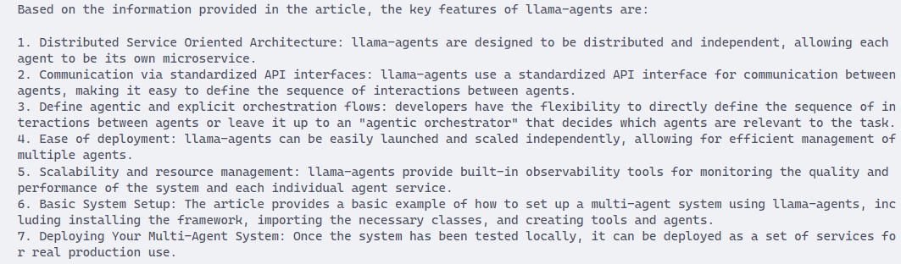

# LlamaIndexHelper
A chatbot specifically designed to answer questions relevant to LlamaIndex from LlamaIndex blogs.

## Data
- Crawl from https://www.llamaindex.ai/blog

## Pipelines

- Crawl and clean html web pages 
- Build local vector database with chromadb, qdrant
- Build document summary index
- Basic RAG with pipeline with Llama2, Zephyr, Llama3 models
- Advance RAG with Router Query Engine, Reranker
  
## Results
<!-- - **Question**: `"What are key features of llama-agents?"`
- **Answer**:
 -->

## TODO
- [x] Enhance querying stage with SummaryIndex and RouterQueryEngine
- [ ] Evaluate RAG pipeline with Ragas